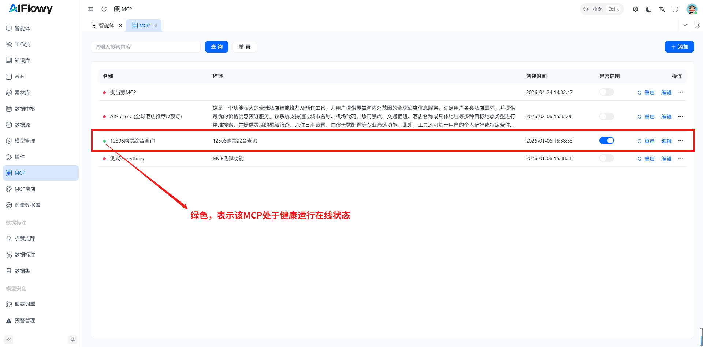
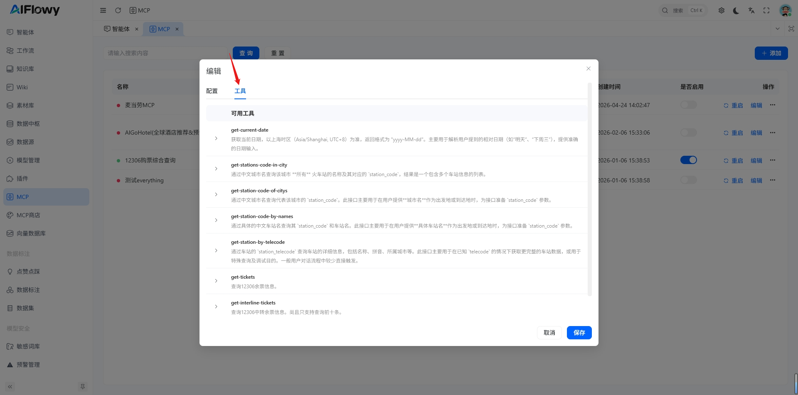
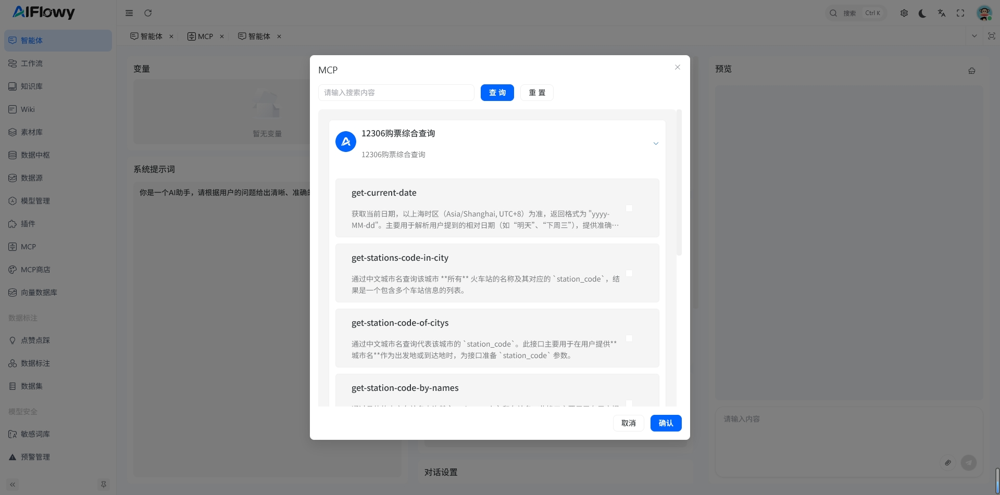
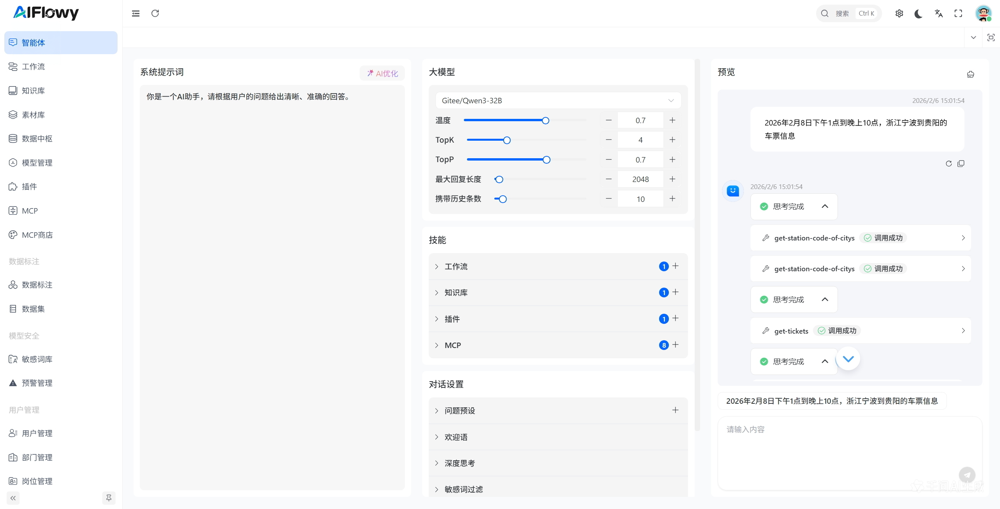
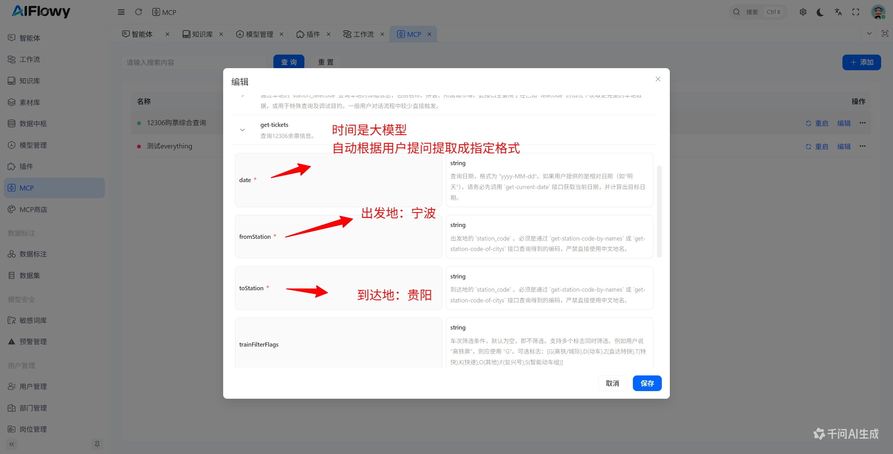
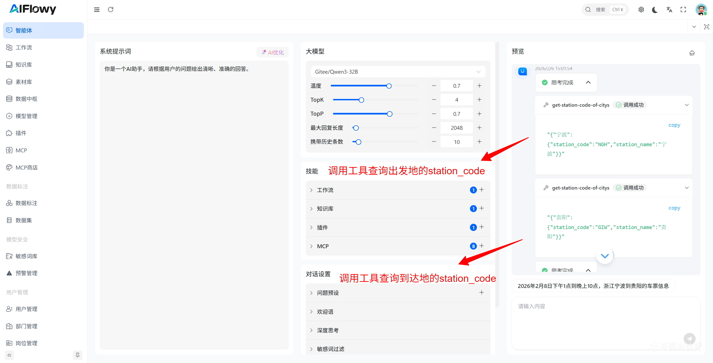
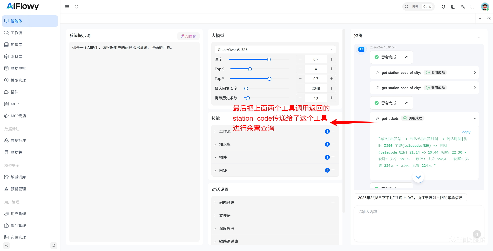
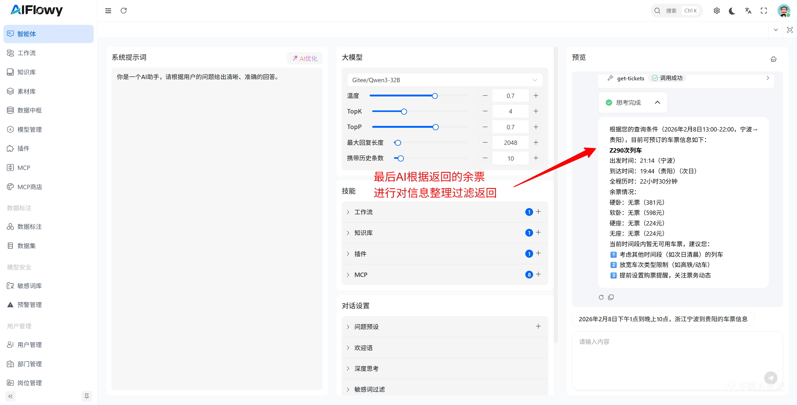

## 1. 创建MCP

创建插件请参考 [如何创建一个MCP](/zh/product/mcp/quick-start)
注意：挂载MCP 之前需要MCP处于启动，并且状态是 **绿色** 健康状态，并且可以查看到可用的工具，如下两张图所示

有工具列表，方可挂载MCP

## 2. 智能体挂载MCP测试

进入智能体配置页面，找到**MCP**模块，点击右上角的 **+**，按钮，会弹出选择MCP窗口，此时等待MCP加载工具列表，如果MCP加载失败，请进入MCP配置页面重新启动该MCP服务

这里我们勾选上全部**12306购票综合查询**服务的MCP工具，然后点击**确定**按钮

## 3. 测试

测试成功如下图所示

## 4. MCP调用过程解读

可以看到，我们这里最后调用的是get-tickets工具，
我们可以先查看这个工具具体需要传递哪些参数

根据用户的提问调用工具查询用户想要查询的出发地和到达地的station_code

余票查询

AI整理消息返回结果

最后我们用自己手机查询12306的余票,可以看到当天的车票信息和我们调用MCP查询返回的数据一致

