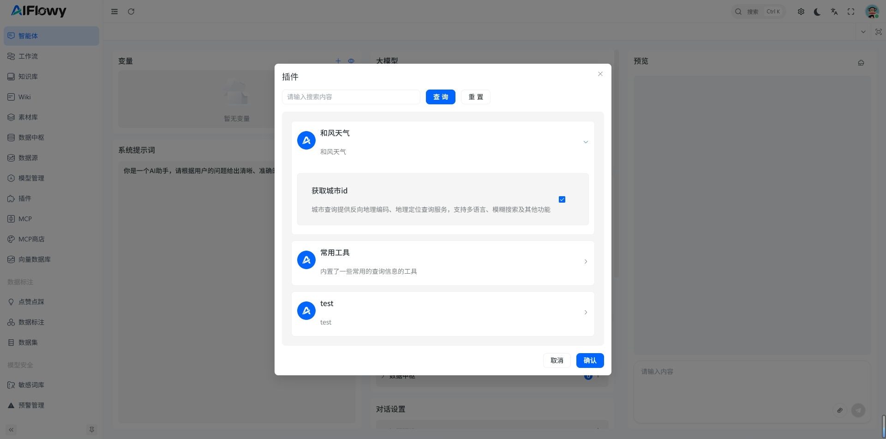
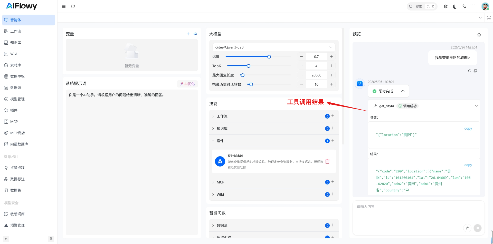
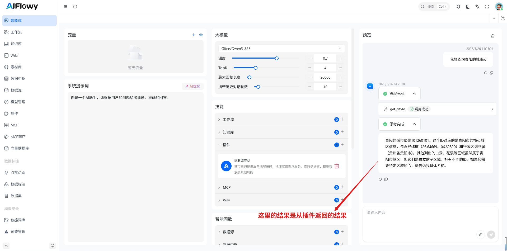

# 1. 创建插件
创建插件请参考 [如何创建一个插件](/zh/product/plugin/quick-start)

## 2. 挂载插件
这里我已成成功的创建了一个**和风天气** 的插件，并且已经测试插件能成功返回数据 
进入 **智能体** 详情页面，点击 **插件** 右上角的 **+** 按钮，选择我们创建好的 插件**获取城市id**，点击 **选择**， 这样就给我们的智能机器人挂上了插件。

## 3. 智能体挂载插件测试

