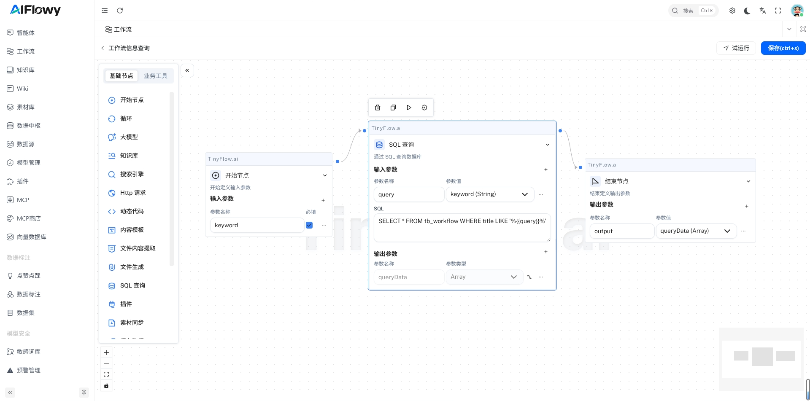
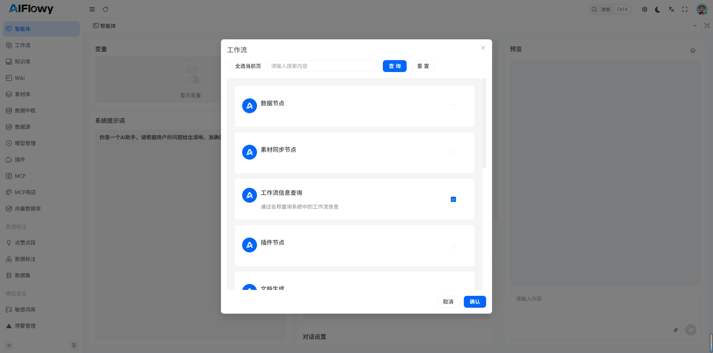
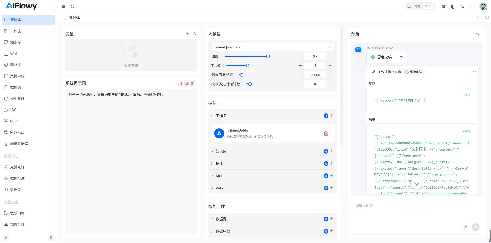
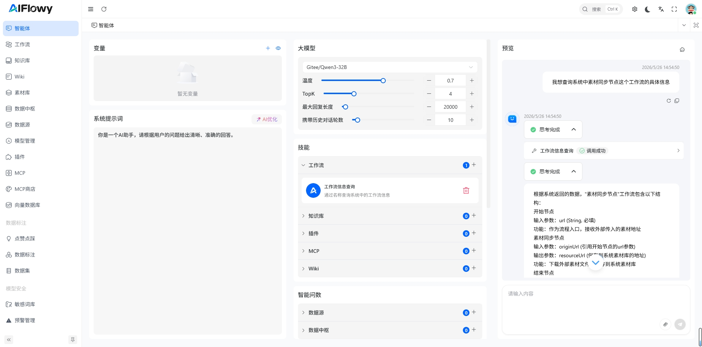

# 挂载工作流

## 1. 创建工作流
若尚未创建工作流，请先参考文档：[如何创建一个工作流](/zh/product/workflow/quick_start)，完成工作流创建后，再进行后续挂载操作。

## 2. 挂载工作流

下图为本次挂载所用的工作流示例，该工作流用于查询数据库中的工作流信息，可通过title关键字实现精准查询：

挂载工作流需按照以下步骤操作，确保操作准确无误：

1. 点击页面左侧菜单栏中的 **智能体**，进入智能体设置页面；

2. 说明：本次挂载操作前，已提前创建好一个名为 **工作流信息查询** 的工作流；

3. 在智能体设置界面，找到 **工作流** 模块，点击该模块右上角的 **+ 按钮**；

4. 在弹出的选择框中，选中提前创建好的工作流；

5. 操作完成后，即可成功为智能体挂载该工作流。

下图中是我创建的查询数据库中的工作流信息，通过title关键字去查询工作流，选择该工作流，挂载到智能体中：

## 3. 工作流测试
如下结果为 **智能体** 从挂载的工作流得到的结果

