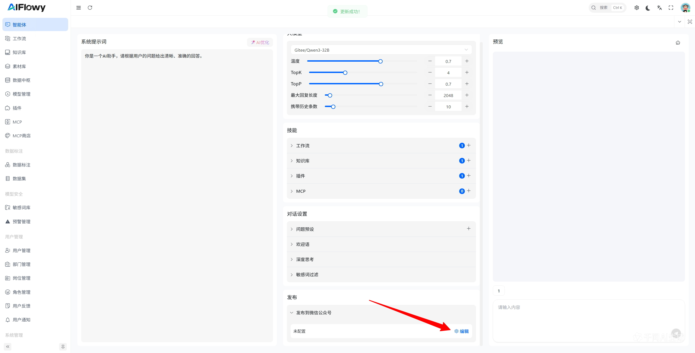
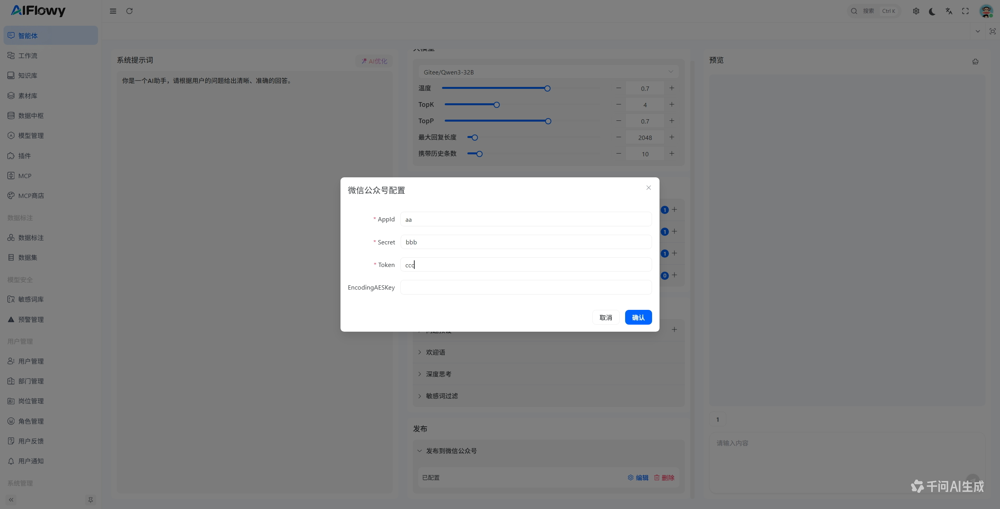
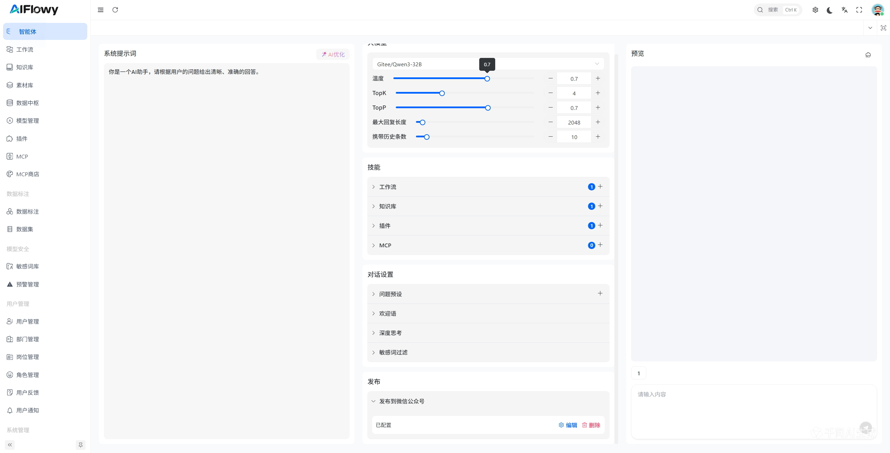

# 智能体 接入微信公众号
## 配置 智能体
在 智能体设置页面中，配置微信公众号所需要的信息

**点击配置按钮，在弹窗中输入微信公众平台配置的 AppId 、 AppSecret 、 Token 、EncodingAESKey(如果启用加密模式)**

### 配置完成示例

## 配置微信公平平台
在 AiFlowy 中配置完成后，将配置弹窗中的“接口地址”复制，进入微信公众平台 → 设置与开发 → 开发接口管理 → 服务器配置

> 测试环境建议使用微信公众平台的测试号
## 检查微信公平台与 AiFlowy 的配置一致性
除了要保证上图中的配置与 AiFlowy 配置一致外，还需要检查下面的配置项
